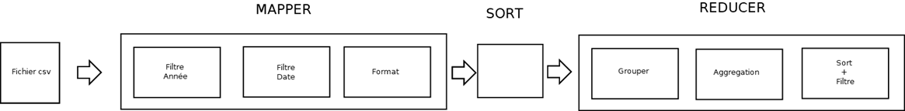

# <p style="text-align:center">Projet Big Data 

### <p style="text-align:center"> **Groupe 1** :
   <p style="text-align:center"> - Garmi GROBOST 
   <p style="text-align:center"> - Rijandrisolo
   <p style="text-align:center"> - Jaouad SALAHY 
   <p style="text-align:center"> - Fares MENTSEUR


### Résumé du projet 
Dans ce projet, nous devons exploiter au mieux les données de l'entreprise *Les Bons Mayennais* qui souhaite :
- Changer de système de stockage de la donnée et passer aux Big Data : **Hadoop**, **Hbase** 
- Sortir des chiffres et des graphiques clés sur du support variés 
- Importer leur données sur PowerBi et profier de toute la puissance visuelle et le filtrage dynamique pour adopter des stratégies commerciales et marketing adaptées

### Structure des données :

Les données sont disponibles dans un fichier CSV.
Dans le tableau suivant, nous présentons les différentes colonnes présentes dans ce fichier, avec une description, ainsi que le type des valeurs 

| **Colonnes**  | **Description**                      | **Type** |
|---------------|--------------------------------------|----------|
| **codcli**    | Code Client                          | Int      |
| **genrecli**  | Genre Client                         | String   |
| **nomcli**    | Nom Client                           | String   |
| **prenomcli** | Prenom Client                        | String   |
| **cpcli**     | Code Postal Client                   | Int      |
| **villecli**  | Ville Client                         | String   |
| **codcde**    | Code Commande                        | Int      |
| **datcde**    | Date Commande                        | Date     |
| **timbrecli** | Timbre Client                        | Float    |
| **timbrecde** | Timbre Commande                      | Float    |
| **Nbcolis**   | Nombre de colis                      | Int      |
| **cheqcli**   | Chaque client                        | Float    |
| **barchive**  | Est\-ce que la commande est archivée | Boolean  |
| **bstock**    | Est\-ce que la commande est stockée  | Boolean  |
| **codobj**    | Code Objet                           | Int      |
| **qte**       | Quantité                             | Int      |
| **Colis**     | Colis                                | Int      |
| **libobj**    | Libelle Objet                        | String   |
| **Tailleobj** | Taille Objet                         | String   |
| **Poidsobj**  | Poids Objet                          | Int      |
| **points**    | Points                               | Int      |
| **indispobj** | Indisponibilite Objet                | Boolean  |
| **libcondit** | Libelle Conditionnement              | String   |
| **prixcond**  | Prix Conditionnement                 | Float    |
| **puobj**     | Prix Unitaire Objet                  | Float    |


### Traitement à réaliser sur la donnée :
Avant tout traitement sur la donnée, nous devons analyser minutieusement la donnée, détecter les anomalies et décider du sort de la colonne ou même de la ligne contenant cette donnée:

- Effacer les lignes contenant des dates non renseignées ou avant l'année 1900 (*12 Lignes*)
- Transformer toutes les colonnes de types alphabétique contenant un **NULL** en une chaine de caractère vide
- Toutes les quantités avec une valeur **NULL** en une quantité égale à **1**
- Et un **zéro** pour toutes les autres colonnes de type *int* ou *float* contenant une valeur égale à **NULL**


### Technos utilisés pour le projet :

- **Excel :** Outil pour une première analyse quantitative et qualitative des données
- **Python :** Langages pour développer les différents programmes 
- **Pandas :** Libraire Python pour les traitements de la data (GroupBy, Filter, Sort etc)
- **Numpy :** Libraire Python pour les calculs statistiques (Moyenne, Médiane, EcartType ..etc)
- **MatPlotLib :** Libraire Python pour la génération de graphe (Histogramme, nuage de points ...etc )
- **Shell :** Pour les scripts linux, pour exécuter les différents programmes dans les containers 
- **Git :** Outil pour la gestion des versions et pour le travail collaboratif 
- **Hbase :** Base de donnée NoSql, pour le Big Data 
- **Hadoop :** Framework pour le stockage et le traitement distribué
- **Docker :** pour créer des contenaires qui encapsulent les Hadoop (Master et Salves)
- **Power BI :** Outil pour exploiter les données issues de différentes sources et les interpréter sur plusieurs types d'affichge et visuel


### MapReduce 

1. Ressortir dans un tableau des 100 meilleures commandes entre 2006 et 2010 des départements 53, 61 et 28
2. Ressortir 5% aléatoire des 100 meilleures entre 2011 et 2016 des départements 22,49 et 53
    

### Résultat MapReduce 




Pour répondre à la question 1 et 2, on utilisera un Job MapReduce :

- Le mappper va lire la donnée du flux d'entrée standard
- Filtrer la donnée par rapport **Années**, **Département** etc..
- Préparer la sortie sous le format Clé, Valeur avec CodeCommande comme Clé et Les autres colonnes nécessaires comme valeur 
- Le Sort est responsable du tri la sortie du mapper sur le clé (CodeCommande)
- Le réducer va regrouper la donnée sur le code commande, aggréger et filtrer afin de répondre aux demandes clients

### LOT 1

#### Sources :  
Les sources du Mapper et du Reducer sont disponibles dans les fichiers respectifs [mapper_lot1.py](mapper_lot1.py) et [reducer_lot1.py](reducer_lot1.py)

#### Script lancement :

```shell
# Effacer le repertoire de sortie 
hdfs dfs -rm -r output/projet_hadoop_lot1

# Lancement du Job MapReduce 
hadoop jar $HADOOP_HOME/share/hadoop/tools/lib/hadoop-streaming-2.7.2.jar -file /root/mapper_lot1.py -mapper "python3 mapper_lot1.py" -file /root/reducer_lot1.py -reducer "python3 reducer_lot1.py" -input /user/root/input/dataw_fro03.csv -output /user/root/output/projet_hadoop_lot1
```
#### Résultats
La liste des 100 meilleurs commandess est présente dans le fichier [Resultats](resultats/lot1/projet_hadoop_bigdata_lot1.xlsx)

### LOT 2

#### Sources :  
Les sources du Mapper et du Reducer sont disponibles dans les fichiers respectifs [mapper_lot2.py](mapper_lot2.py) et [reducer_lot2.py](reducer_lot1.py)

#### Script Lde lancement :

```shell
# Effacer le repertoire de sortie 
hdfs dfs -rm -r output/projet_hadoop_lot2

# Lancement du Job MapReduce 
hadoop jar $HADOOP_HOME/share/hadoop/tools/lib/hadoop-streaming-2.7.2.jar -file /root/mapper_lot2.py -mapper "python3 mapper_lot2.py" -file /root/reducer_lot2.py -reducer "python3 reducer_lot2.py" -input /user/root/input/dataw_fro03.csv -output /user/root/output/projet_hadoop_lot2

```
#### Résultats
Les résultats sont disponibles dans le répertoire "resultats/lot2" dans les fichiers [Fichier Xlsx ](resultats/lot2/projet_hadoop_bigdata_lot2.xlsx) et [Graphique PDF](resultats/lot2/Pie_Diagram_Lot2.pdf)


### Hbase 

Pour utiliser Hbase et profiter de ce nouveau système, nous devons tout dabord insérer nos données et pour cela il faut :

- Se connecter à la base de données Hbase, qui tourne sur le *container* Hadoop-Master 
- Créer la table **data_fromagerie** 
- Lire le fichier CSV [Fichier CSV](datas/dataw_fro03.csv) 
- Parcourir toutes les lignes du fichier 
- Formater la donnée en binary
- Insertion en base 

Le schéma résume les étapes suivies 

 

Une fois la donnée stockée en base, pour répondre aux différentes demandes du client, le process sera le suivant 

- Connexion à la base 
- Scan de la table avec un filtre ou une séléction de colonnes à charger pour réduire la taille chargée de la base 
- Charger la donnée dans des **DataFrame PANDAS** 
- Faire des aggrégation sur la donnée (GroupBy, Sort et Filter) pour obtenir la donnée qui correspond à la demande client
- Exporter les différents résultats visuels ou tableaux dans des fichiers 

Le schéma résume les étapes 

 

#### Sourrces 
Pour l'insertion en base : [**lot3_insertion_hbase.py**](lot3_insertion_hbase.py) 
Pour la meilleure commande de Nantes de l'année 2020 : [**lot3_meilleur_commande_nantes.py**](lot3_meilleur_commande_nantes.py)
Pour e nombre total de commandes effectuées entre 2010 et 2015 : [**lot3_total_commandes_2010_2015.py**](lot3_total_commandes_2010_2015.py)
Pour les infos du client qui a eu le plus de frais de timbre-commande : [**lot3_meilleur_client.py**](lot3_meilleur_client.py)
#### Résultats 

Pour la meilleure commande de Nantes de l'année 2020 : [**meilleur_commande_nantes_2020.csv**](resultats/lot3/meilleur_commande_nantes_2020.csv)
Pour e nombre total de commandes effectuées entre 2010 et 2015 : [**BarPlot_total_commandes_2010_2015.pdf**](resultats/lot3/BarPlot_total_commandes_2010_2015.pdf)
Pour les infos du client qui a eu le plus de frais de timbre-commande : [**meilleur_client_timbre_code.xlsx**](resultats/lot3/meilleur_client_timbre_code.xlsx)


### PowerBi

 

Pour la partie powerbi, on a pensé à rajouter quelques infos qui sont représentées sur le schéma :

- Le pays : qui est une valeur constante **FRANCE**, pour que toutes les villes soient représentées sur la map de la france 
- Le département, qui représente les deux premiers chiffres du code postal 
- la région, est un regroupement de département pour former une région 


### Maps 

#### Orienté Ville 

Pour ce visuel, on voulait mettre l'accent sur la répartition des clients et les commandes sur les villes, qui servira par la suite au client de prendre des décisions sur sa présence  en France 

Et grâce aux filtres, on peut se focalier sur une région ou même une ville précise 

 

 


#### Orienté Client 

Sur ce visuel, le client est le centre, et pour cela on a essayé de voir les meilleurs clients, le genre de clients, l'évolution de la fidélisation des clients

 

#### Orienté Objet 

Pour ce dernier visuel, les objets commandés est notre centre d'inertie, ainsi on comprendra ce qu'aime nos clients et par la suite changer les produits rarement commandés et autres analyses 

 
